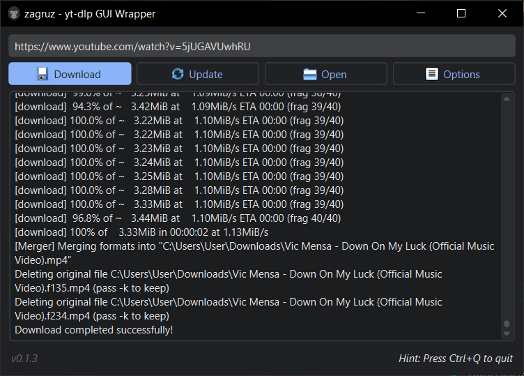

# zagruz - yt-dlp GUI Wrapper


A cross-platform GUI frontend for yt-dlp featuring:

- Download videos/audio from 1000+ sites
- Presets: Best, TV (480p), Audio (320kbps)
- Themes: System/Light/Dark
- Languages: English, Russian
- Built-in FFmpeg updater
- Persistent configuration: language/preset/theme/etc



## Usage

```bash
git clone https://github.com/yahorni/zagruz.git
cd zagruz
make  # same as: make init run
```

## Dependencies

- [yt-dlp](https://github.com/yt-dlp/yt-dlp) - Video download backend
- [PySide6](https://doc.qt.io/qtforpython-6/) - GUI framework
- [PyQtDarkTheme](https://github.com/5yutan5/PyQtDarkTheme/) - Qt themes

## Build and run

```bash
# install dependencies
make init

# 1. run using make
make run
# 2. run using uv
uv run zagruz

# build bundled executable (pyinstaller)
make package
# 1. run using make
make run-package
# 2. run using the package itself
./dist/linux/zagruz-linux-0.1.4

# build python wheel
make wheel
# 1. run using make
make run-wheel
# 2. run using uv
uvx dist/wheel/zagruz-0.1.4-py3-none-any.whl zagruz

# clean all build artifacts
make clean
```

## License


